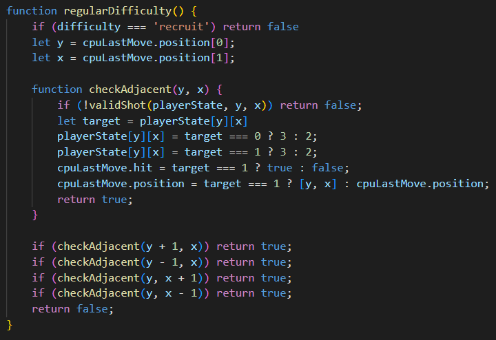

# Battleship Game
---

## Description
Project 1 of General Assembly SEI (building a browser game). The game was made using HTML, CSS and JavaScript.
Game Link: https://ryanbulluss.github.io/Battleship-game/
Code installation link?

## Brief
The game must:
- Render in browser
- Include win/loss logic
- Use vanilla JavaScript
- Be deployed online
- Have Ai opponent

## Planning
### Wireframe:

The plan for UI was to have 4 seperate displays to break up the game and allow the user to focus in on their current action

[Psudocode for MVP.TXT](https://github.com/RyanBulluss/Battleship-game/files/11904538/Psudocode.for.MVP.TXT)

## Code Process
The first challenge with the coding of the game was to figure out how to create a dynamic board size in order to allow the user to have contol over how they want to play the game.
To do this I used a CSS variable for the amount of rows & columns which will change to the value that the user chooses. 

---

Another challenge was with detecting the bounds of the board so that the user or cpu can only place ships in valid positions. My solution for this was to get the first position of the ship via random number for AI or by the clicked cell by ID. With this first position I created a loop that finds the coordinates of the whole ship using the length and angle. Once I have an array with all ship positions, I can check that they are all within board range and not already a ship.

 

This is diplayed on the ship placement screen with a hover effect to show the user where they are placing the ship and whether or not it is valid.

---

Another difficult part to implement was the AI shot predictions to be more human like. The goal was for the cpu player to shoot adjacent tiles after they hit a ship. In order to implement this I needed to track the last hit location and calculate the adjacent tiles and if they were valid shots (On the board and not already shot)

The code above is nested into the AI function and allows for the AI to try each adjacent tile (by passing x + 1 etc.) 
With that I was able to get the AI to zone in on ship locations like a real player would do.

--- 

## Challenges 
The further I got in the project, the more I came up with better ways i could have done things. This lead me to refactoring a lot of code but I did not have time to go back over everything. One of the mistakes I made early on was in creating the game states as a 2D array of numbers. Instead I should have made a class to create individual objects for each board position to contain: type of ship, ship edges and other important information about the state of the game. Because I only stored numbers to represent the ships, miss and hits, it made creating new features much harder. I also found it difficult to make the game look.

## Wins
- Dynamic game size, ships and difficulty
- Ship placement hover effect
- Competitive Ai opponent
- No known bugs
- Somewhat responsive design

---

## Key Learnings
One of the biggest lessons I learned in coding this project was to properly plan everything out before hand. This would have helped to make my life easier without having to go back and refactor code. It would also have helped to fully plan out the UI early on as the design of the game was something i could have done better in hindsight.

---

## Future Improvements
- Better AI (Spread out random shots to search for ships better)
- Better UI (Ship detail, Winning screen etc.)
- Player vs Player mode
- Abilities
- Hit/Miss animations